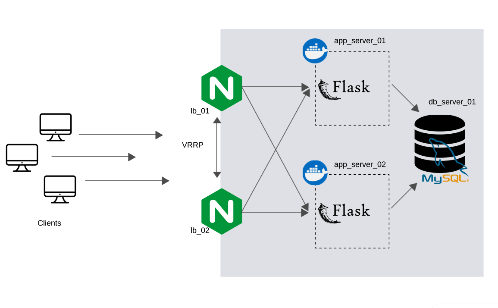

# Проектная работа
__Тема__: Развертывание веб-приложения на базе фреймворка _Flask_ с использованием балансировки нагрузки средствами _Nginx_. Применение стека _Flask_ + _Nginx_ + _MySQL_.

<h5 align='center'>Стенд</h5>

